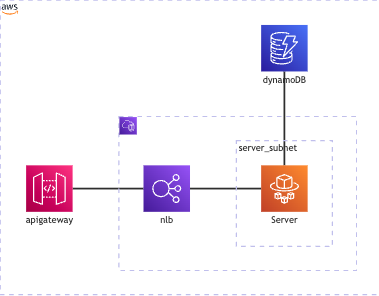

# Serverless API With AWS CDK

serverless APIでAWS CDKを使ってみる

## 構成

```mermaid
architecture-beta
    group aws(logos:aws)
    group vpc(logos:aws-vpc) in aws
    group server_subnet[server_subnet] in vpc

    service apigateway(logos:aws-api-gateway)[apigateway] in aws

    service server(logos:aws-fargate)[Server] in server_subnet
    service nlb(logos:aws-elb)[nlb] in vpc
    service dynamodb(logos:aws-dynamodb)[dynamoDB] in aws


    nlb:L -- R:apigateway
    server:L -- R:nlb
    dynamodb:B -- T:server
```



<details><summary>コード</summary>


</details>


## デプロイ

```bash
# APIGateway + ECS をデプロイ
AWS_PROFILE=serverless cdk deploy CleanServerlessBookSampleEcsStack

# DynamoDBをデプロイ
AWS_PROFILE=serverless cdk deploy CleanServerlessBookDynamoStack

# 今回のサンプルでは使用していない
# RDS をデプロイ
AWS_PROFILE=serverless cdk deploy CleanServerlessBookSampleRdsStack

```

## 参考

AWS CDKの使い方

* `npm run build`   compile typescript to js
* `npm run watch`   watch for changes and compile
* `npm run test`    perform the jest unit tests
* `cdk deploy`      deploy this stack to your default AWS account/region
* `cdk diff`        compare deployed stack with current state
* `cdk synth`       emits the synthesized CloudFormation template
